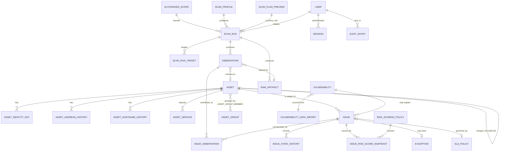

# Database Schema — Read-Only Vulnerability Management Appliance

Status: Accepted at GATE 1. Target engine: **PostgreSQL 16+**, single instance, no logical sharding, no multi-tenant isolation (one appliance = one customer organisation).

This document is the schema-level companion to the domain model in Part C of the master build prompt. Every table below is traced to the requirement ID(s) that justify its existence in the **Traceability Matrix** (§14). Nothing here should be implemented if the corresponding requirement is not confirmed — flag disagreements as ADRs per `WORK-03`, don't silently change shape.

---

## 1. Conventions

These conventions are binding across all migrations, not just this first one, and should be lifted into `docs/adr/0007-schema-conventions.md` verbatim per `1.4`.

- **Primary keys.** UUIDv7 (time-sortable), generated in the application layer (`packages/domain`) at object-creation time — not `gen_random_uuid()` — so identifiers are k-sortable and creation order is inferable without a separate `created_at` scan. Exception: `audit_entries`, which uses a `BIGSERIAL` because the hash chain requires strict monotonic ordering guaranteed by the database, not client clocks.
- **Timestamps.** Every timestamp column is `timestamptz`, written in UTC (`DATA-06`). Display-timezone conversion happens at the API/UI boundary using `organization_settings.timezone`. No `timestamp without time zone` column is permitted anywhere in the schema — enforce with a CI lint over `information_schema.columns`.
- **Naming.** Tables: plural snake_case. Columns: snake_case. Foreign keys: `<referenced_singular>_id`. Enums: `<concept>_enum` type name, values in snake_case.
- **Soft delete vs. lifecycle state.** There is no generic `deleted_at` column. Entities that can be retired carry an explicit lifecycle/state enum (`assets.lifecycle_state`, `issues.state`, `authorized_scopes.is_active`, etc.) because "deleted" is never an honest description of what happened to a security record — it was resolved, superseded, merged, or excluded, and the schema says which.
- **Immutability.** Tables backing `MOD-03`, `DATA-01`, `DATA-02` (`observations`, `raw_artifacts`, `audit_entries`) are append-only. Enforce with `REVOKE UPDATE, DELETE` from the application role and grant a separate, narrowly-scoped `retention_worker` role the only path to delete rows, and only rows older than policy.
- **JSONB usage.** JSONB is used only where the shape is genuinely variable or evidence-sourced (adapter-extracted attributes, evidence payloads, risk-factor breakdowns, pacing config). Every JSONB column has a documented schema referenced in a comment and validated at the API boundary (`SEC-12`), never trusted from the column alone. JSONB is never used as an escape hatch for relational data that has a stable shape.
- **Untrusted strings.** Per `SEC-17`/`AIP-02`, any column that stores a value originating from a scanned target (banners, page titles, certificate subjects, header values) is suffixed `_untrusted` or lives inside an `evidence`/`untrusted_evidence` JSONB blob, never a bare `text` column that looks like first-party data. This is a naming convention with teeth: a grep for `_untrusted` or `untrusted_evidence` is a CI check that every consumer escapes on output.
- **Foreign keys.** Default `ON DELETE RESTRICT`. `ON DELETE CASCADE` is used only for true ownership join rows (e.g., `issue_observations`, `asset_group_members`) where the child row has no independent meaning.
- **Partitioning readiness.** At `PERF-01` volumes (5k assets / 50k issues / 250k observations) no table is partitioned in this release. `observations` and `audit_entries` are the two tables most likely to need range partitioning by month at higher scale (`v2.0`); their primary keys already include a natural partition key (`observed_at`, `id`/sequence) so adding partitioning later is a storage-layer change, not a schema or query rewrite.
- **Extensions required:** `pgcrypto` (UUID/hash helpers), `citext` (case-insensitive email), `btree_gin` / `pg_trgm` (search over evidence and free text).

---

## 2. Entity-relationship overview



The four load-bearing entities — `assets`, `vulnerabilities`, `observations`, `issues` — sit at the centre. Everything else configures how they're populated (scanning/safety), governs how they're worked (lifecycle/SLA/exceptions), or proves how they got there (evidence/audit). This shape is `MOD-01`–`MOD-04` and `SCOPE-02`; it does not change across steps.

---

## 3. Enumerated types

```sql
CREATE TYPE user_role_enum AS ENUM ('viewer', 'analyst', 'operator', 'administrator');

CREATE TYPE asset_lifecycle_state_enum AS ENUM ('active', 'inactive', 'decommissioned', 'merged');
CREATE TYPE exposure_classification_enum AS ENUM ('internal', 'dmz', 'external', 'unknown');
CREATE TYPE asset_criticality_enum AS ENUM ('low', 'medium', 'high', 'critical');

CREATE TYPE identity_key_type_enum AS ENUM ('machine_uuid', 'serial_number', 'mac_address', 'fqdn', 'certificate_fingerprint');

CREATE TYPE issue_state_enum AS ENUM (
  'new', 'triaged', 'in_progress', 'mitigated',
  'verified_resolved', 'reopened', 'false_positive', 'risk_accepted'
);
-- No confidence_label_enum: Postgres does not treat a text->enum cast as
-- IMMUTABLE, so issues.confidence_label (below) is a GENERATED `text` column
-- constrained to the same three values, not this type. Caught by actually
-- running this migration against Postgres 16 rather than assuming it would work.

CREATE TYPE exception_status_enum AS ENUM ('pending', 'approved', 'rejected', 'expired', 'revoked');

CREATE TYPE intrusiveness_profile_enum AS ENUM ('passive-inventory', 'safe', 'standard');
CREATE TYPE attestation_type_enum AS ENUM ('self_attested_owner', 'delegated_authority', 'contract_engagement', 'other');
CREATE TYPE exclusion_rule_type_enum AS ENUM ('address', 'range', 'port', 'tag');

CREATE TYPE scan_run_status_enum AS ENUM ('queued', 'running', 'paused', 'completed', 'aborted', 'failed');
CREATE TYPE scan_target_status_enum AS ENUM (
  'pending', 'in_progress', 'completed', 'failed',
  'excluded', 'skipped_blackout', 'skipped_fragile_downgrade'
);
CREATE TYPE verification_outcome_enum AS ENUM ('pending', 'confirmed_resolved', 'still_present', 'inconclusive');

CREATE TYPE report_template_enum AS ENUM ('executive_summary', 'technical_detail', 'delta');
CREATE TYPE report_status_enum AS ENUM ('pending', 'completed', 'failed');

CREATE TYPE notification_channel_type_enum AS ENUM ('email', 'webhook');
CREATE TYPE notification_mode_enum AS ENUM ('immediate', 'digest');
CREATE TYPE notification_status_enum AS ENUM ('pending', 'sent', 'failed');

CREATE TYPE audit_outcome_enum AS ENUM ('success', 'failure', 'denied');

CREATE TYPE retention_data_class_enum AS ENUM ('raw_artifacts', 'observations', 'resolved_issues', 'audit_log');
```

Controlled vocabularies that are subject to review by non-engineers (false-positive reasons) are lookup tables, not enums, so product/security can extend them without a migration and deployment:

```sql
CREATE TABLE false_positive_reasons (
  code            text PRIMARY KEY,
  label           text NOT NULL,
  description     text NOT NULL,
  is_active       boolean NOT NULL DEFAULT true,
  created_at      timestamptz NOT NULL DEFAULT now()
);
-- seed: not_applicable_environment, patched_not_reflected, false_signature_match,
--       compensating_control, duplicate_of_other_issue, other
```

---

## 4. Identity, access, and sessions

```sql
CREATE TABLE users (
  id                    uuid PRIMARY KEY,
  email                 citext NOT NULL UNIQUE,
  display_name          text NOT NULL,
  role                  user_role_enum NOT NULL,
  password_hash         text NOT NULL,             -- full argon2id encoded string incl. params (SEC-07)
  password_changed_at   timestamptz NOT NULL DEFAULT now(),
  mfa_enabled           boolean NOT NULL DEFAULT false,
  mfa_secret_ref        text,                       -- opaque reference into secret storage, never the raw secret (SEC-05)
  is_active             boolean NOT NULL DEFAULT true,
  failed_login_count    integer NOT NULL DEFAULT 0,
  locked_until          timestamptz,
  created_at            timestamptz NOT NULL DEFAULT now(),
  updated_at            timestamptz NOT NULL DEFAULT now(),
  CONSTRAINT mfa_required_for_privileged_roles
    CHECK (role NOT IN ('operator', 'administrator') OR mfa_enabled)  -- SEC-09, enforced again at app layer before role grant
);

CREATE TABLE mfa_recovery_codes (
  id           uuid PRIMARY KEY,
  user_id      uuid NOT NULL REFERENCES users(id) ON DELETE CASCADE,
  code_hash    text NOT NULL,
  used_at      timestamptz,
  created_at   timestamptz NOT NULL DEFAULT now()
);
CREATE INDEX idx_mfa_recovery_codes_user ON mfa_recovery_codes(user_id) WHERE used_at IS NULL;

-- Opaque server-side sessions (SEC-08). The cookie carries only a random token;
-- this table carries the hash of that token, never the token itself.
CREATE TABLE sessions (
  id                    uuid PRIMARY KEY,
  user_id               uuid NOT NULL REFERENCES users(id) ON DELETE CASCADE,
  session_token_hash    text NOT NULL UNIQUE,
  csrf_token_hash       text NOT NULL,
  source_address        inet NOT NULL,
  user_agent            text,
  created_at            timestamptz NOT NULL DEFAULT now(),
  last_seen_at          timestamptz NOT NULL DEFAULT now(),
  idle_expires_at       timestamptz NOT NULL,
  absolute_expires_at   timestamptz NOT NULL,
  revoked_at            timestamptz,
  revoked_reason        text
);
CREATE INDEX idx_sessions_user ON sessions(user_id) WHERE revoked_at IS NULL;

-- Backs SEC-11 rate limiting / lockout and feeds audit_entries for the definitive record.
CREATE TABLE auth_events (
  id                 bigserial PRIMARY KEY,
  event_type         text NOT NULL CHECK (event_type IN ('login_success','login_failure','lockout','export','scan_creation')),
  actor_identifier   text NOT NULL,          -- email attempted, or user_id once known
  source_address     inet NOT NULL,
  occurred_at        timestamptz NOT NULL DEFAULT now(),
  metadata           jsonb NOT NULL DEFAULT '{}'::jsonb
);
CREATE INDEX idx_auth_events_lookup ON auth_events(actor_identifier, source_address, occurred_at DESC);
```

There is no `roles` table: `SCOPE-01`/anti-goal on custom roles means the four roles in `user_role_enum` are fixed for this release; adding a role definition table is v1.3 work (`Custom roles and scoped permissions`, Appendix).

---

## 5. Organisation settings and feature flags

```sql
-- Singleton — one appliance, one organisation. Enforced by a CHECK on a fixed id.
CREATE TABLE organization_settings (
  id                        smallint PRIMARY KEY DEFAULT 1 CHECK (id = 1),
  organization_name         text NOT NULL,
  timezone                  text NOT NULL,          -- IANA tz name, e.g. 'Asia/Tehran' (DATA-06)
  tls_mode                  text NOT NULL DEFAULT 'self_signed' CHECK (tls_mode IN ('self_signed', 'customer_certificate')),
  setup_completed_at        timestamptz,
  safety_defaults_acknowledged_by   uuid REFERENCES users(id),
  safety_defaults_acknowledged_at   timestamptz,
  updated_at                timestamptz NOT NULL DEFAULT now()
);

-- EXT-07: all gating routes through this table so packaging changes touch one place.
-- Client-side flags are cosmetic only; server-side checks are the real gate (SEC-13).
CREATE TABLE feature_flags (
  key            text PRIMARY KEY,
  description    text NOT NULL,
  is_enabled     boolean NOT NULL DEFAULT false,
  updated_by     uuid REFERENCES users(id),
  updated_at     timestamptz NOT NULL DEFAULT now()
);
-- seed row enforced permanently off, checked by CI (EXT-09):
-- ('remediation_executor_enabled', 'Rung 3 execution capability — no implementation exists', false, NULL, now())
```

---

## 6. Scan safety and scope configuration (`SAFE-01`…`SAFE-08`)

```sql
-- SAFE-01: immutable once accepted. "Changing" a scope creates a new row and
-- points the old one at its successor; nothing here is ever UPDATEd after acceptance.
CREATE TABLE authorized_scopes (
  id                   uuid PRIMARY KEY,
  name                 text NOT NULL,
  cidr_ranges          cidr[] NOT NULL DEFAULT '{}',
  hostnames            text[] NOT NULL DEFAULT '{}',
  attestation_type     attestation_type_enum NOT NULL,
  attestation_details  text NOT NULL,
  accepted_by_user_id  uuid NOT NULL REFERENCES users(id),
  accepted_at          timestamptz NOT NULL DEFAULT now(),
  superseded_by_id     uuid REFERENCES authorized_scopes(id),
  CONSTRAINT scope_has_targets CHECK (cardinality(cidr_ranges) > 0 OR cardinality(hostnames) > 0)
);
CREATE INDEX idx_authorized_scopes_active ON authorized_scopes(id) WHERE superseded_by_id IS NULL;

-- SAFE-02: enforced at scan-plan validation AND again in the worker (application-layer,
-- not the database) immediately before dispatch — this table is the single source both
-- checks read from, so there is one place a change takes effect, not two to keep in sync.
CREATE TABLE exclusion_rules (
  id            uuid PRIMARY KEY,
  scope_id      uuid REFERENCES authorized_scopes(id),   -- NULL = applies globally
  rule_type     exclusion_rule_type_enum NOT NULL,
  value         text NOT NULL,             -- address/CIDR text, port number, or tag key:value
  reason        text NOT NULL,
  created_by    uuid NOT NULL REFERENCES users(id),
  created_at    timestamptz NOT NULL DEFAULT now(),
  is_active     boolean NOT NULL DEFAULT true
);
CREATE INDEX idx_exclusion_rules_active ON exclusion_rules(scope_id) WHERE is_active;

-- System-wide hard ceilings (SAFE-04). Singleton; profile-level pacing may configure
-- below these values, never above — enforced by a CHECK against this row at the
-- application layer on every scan_profiles write, not by SQL trigger (keeps validation
-- logic in one place testable in packages/domain).
CREATE TABLE pacing_ceilings (
  id                              smallint PRIMARY KEY DEFAULT 1 CHECK (id = 1),
  max_packets_per_second          integer NOT NULL,
  max_concurrent_hosts            integer NOT NULL,
  max_concurrent_ports_per_host   integer NOT NULL,
  max_timeout_ms                  integer NOT NULL,
  max_retries                     integer NOT NULL,
  updated_by                      uuid REFERENCES users(id),
  updated_at                      timestamptz NOT NULL DEFAULT now()
);

-- SAFE-03/SAFE-04
CREATE TABLE scan_profiles (
  id                       uuid PRIMARY KEY,
  name                     text NOT NULL,
  intrusiveness            intrusiveness_profile_enum NOT NULL DEFAULT 'safe',
  pacing                   jsonb NOT NULL,   -- {packets_per_second, concurrent_hosts, concurrent_ports_per_host, timeout_ms, retries}
  requires_confirmation    boolean NOT NULL DEFAULT false,  -- true for 'standard' (SAFE-03)
  created_by               uuid NOT NULL REFERENCES users(id),
  created_at               timestamptz NOT NULL DEFAULT now(),
  updated_at               timestamptz NOT NULL DEFAULT now()
);

-- SAFE-05: bundled heuristics identifying fragile device classes.
CREATE TABLE fragile_device_rules (
  id              uuid PRIMARY KEY,
  device_class    text NOT NULL,        -- e.g. 'printer', 'plc', 'medical_device', 'legacy_network_gear'
  match_criteria  jsonb NOT NULL,       -- structured matcher: OUI prefixes, banner patterns, port signatures
  action          text NOT NULL DEFAULT 'downgrade_to_passive_inventory',
  is_enabled      boolean NOT NULL DEFAULT true
);

-- SAFE-06: blackout windows, global (scope_id NULL) or per-scope.
CREATE TABLE blackout_windows (
  id            uuid PRIMARY KEY,
  scope_id      uuid REFERENCES authorized_scopes(id),
  name          text NOT NULL,
  timezone      text NOT NULL,
  starts_at     timestamptz NOT NULL,
  ends_at       timestamptz NOT NULL,
  is_recurring  boolean NOT NULL DEFAULT false,
  rrule         text,                 -- iCal RRULE when recurring
  created_by    uuid NOT NULL REFERENCES users(id),
  created_at    timestamptz NOT NULL DEFAULT now(),
  CONSTRAINT blackout_window_valid_range CHECK (ends_at > starts_at)
);

CREATE TABLE scan_schedules (
  id                uuid PRIMARY KEY,
  name              text NOT NULL,
  scope_id          uuid NOT NULL REFERENCES authorized_scopes(id),
  profile_id        uuid NOT NULL REFERENCES scan_profiles(id),
  cron_expression   text NOT NULL,
  timezone          text NOT NULL,
  next_run_at       timestamptz,
  is_enabled        boolean NOT NULL DEFAULT true,
  created_by        uuid NOT NULL REFERENCES users(id),
  created_at        timestamptz NOT NULL DEFAULT now()
);
```

---

## 7. Scan execution (`SAFE-07`, `SAFE-08`, `P2-*`)

```sql
-- SAFE-08: the pre-flight plan a user must confirm before a scan is created.
CREATE TABLE scan_plan_previews (
  id                      uuid PRIMARY KEY,
  scope_id                uuid NOT NULL REFERENCES authorized_scopes(id),
  profile_id              uuid NOT NULL REFERENCES scan_profiles(id),
  target_count            integer NOT NULL,
  estimated_packet_volume bigint NOT NULL,
  estimated_duration_seconds integer NOT NULL,
  excluded_targets        jsonb NOT NULL DEFAULT '[]'::jsonb,
  fragile_downgrades      jsonb NOT NULL DEFAULT '[]'::jsonb,
  generated_at            timestamptz NOT NULL DEFAULT now(),
  confirmed_by_user_id    uuid REFERENCES users(id),
  confirmed_at            timestamptz
);

CREATE TABLE scan_runs (
  id                     uuid PRIMARY KEY,
  plan_preview_id        uuid NOT NULL REFERENCES scan_plan_previews(id),
  scope_id               uuid NOT NULL REFERENCES authorized_scopes(id),
  profile_id             uuid NOT NULL REFERENCES scan_profiles(id),
  schedule_id            uuid REFERENCES scan_schedules(id),   -- NULL if manually triggered
  initiated_by_user_id   uuid REFERENCES users(id),            -- NULL if schedule-triggered
  status                 scan_run_status_enum NOT NULL DEFAULT 'queued',
  correlation_id         uuid NOT NULL,        -- OPS-01: propagated through queue job + scanner invocation
  queued_at              timestamptz NOT NULL DEFAULT now(),
  started_at             timestamptz,
  paused_at              timestamptz,
  completed_at           timestamptz,
  aborted_by_user_id     uuid REFERENCES users(id),
  aborted_reason         text,
  CONSTRAINT scan_run_requires_initiator CHECK (schedule_id IS NOT NULL OR initiated_by_user_id IS NOT NULL)
);
CREATE INDEX idx_scan_runs_status ON scan_runs(status) WHERE status IN ('queued', 'running', 'paused');

-- Per-target dispatch and outcome — this is what a packet-capture audit (GATE 4) is
-- reconciled against: any target NOT in this table, or present with status <> 'excluded'
-- while matching an exclusion_rules row, is a defect.
CREATE TABLE scan_run_targets (
  id                     uuid PRIMARY KEY,
  scan_run_id            uuid NOT NULL REFERENCES scan_runs(id) ON DELETE CASCADE,
  target_address         text NOT NULL,
  target_port            integer,
  status                 scan_target_status_enum NOT NULL DEFAULT 'pending',
  excluded_by_rule_id    uuid REFERENCES exclusion_rules(id),
  fragile_rule_id        uuid REFERENCES fragile_device_rules(id),
  adapter_key            text NOT NULL,
  started_at             timestamptz,
  completed_at           timestamptz,
  failure_class          text
);
CREATE INDEX idx_scan_run_targets_run ON scan_run_targets(scan_run_id, status);

-- SAFE-07: one control, reachable from every screen, plus a documented CLI equivalent.
CREATE TABLE global_stop_events (
  id                    uuid PRIMARY KEY,
  invoked_by_user_id    uuid REFERENCES users(id),   -- NULL if invoked via CLI under a service account, logged separately
  invoked_via           text NOT NULL CHECK (invoked_via IN ('web', 'cli')),
  invoked_at            timestamptz NOT NULL DEFAULT now(),
  reason                text,
  scan_runs_halted      uuid[] NOT NULL DEFAULT '{}'
);

-- 4.6: narrowly scoped re-checks that are this product's substitute for remediation.
CREATE TABLE verification_scans (
  id                 uuid PRIMARY KEY,
  issue_id           uuid NOT NULL REFERENCES issues(id),
  scan_run_id        uuid NOT NULL REFERENCES scan_runs(id),
  requested_by       uuid REFERENCES users(id),      -- NULL if scheduled
  requested_at       timestamptz NOT NULL DEFAULT now(),
  outcome            verification_outcome_enum NOT NULL DEFAULT 'pending',
  resolved_at        timestamptz
);
CREATE INDEX idx_verification_scans_issue ON verification_scans(issue_id);
```

Scanner adapters themselves are code (`ScannerAdapter` interface, `P2-01`), but each invocation's declared identity and fidelity is recorded relationally so it can be joined from observations and shown in the UI (`MOD-19` corroboration depends on knowing which adapter said what):

```sql
CREATE TABLE scanner_adapters (
  id                uuid PRIMARY KEY,
  adapter_key       text NOT NULL,     -- e.g. 'network-discovery', 'template-checks'
  version           text NOT NULL,
  fidelity_rating   numeric(3,2) NOT NULL CHECK (fidelity_rating BETWEEN 0 AND 1),
  capabilities      jsonb NOT NULL DEFAULT '{}'::jsonb,
  is_enabled        boolean NOT NULL DEFAULT true,
  UNIQUE (adapter_key, version)
);
```

---

## 8. Vulnerability intelligence (`MOD-02`, `P2-06`…`P2-09`)

```sql
-- P2-06/07: versioned, atomically-applied import so a failed import never leaves
-- a partial catalogue live.
CREATE TABLE vulnerability_data_imports (
  id                  uuid PRIMARY KEY,
  source_name         text NOT NULL,          -- e.g. 'nvd-cve', 'cisa-kev', 'epss'
  source_version      text NOT NULL,
  bundle_signature    text NOT NULL,
  status              text NOT NULL DEFAULT 'validating' CHECK (status IN ('validating', 'applied', 'failed', 'superseded')),
  record_counts       jsonb,
  imported_by         uuid REFERENCES users(id),
  imported_at         timestamptz NOT NULL DEFAULT now(),
  superseded_by_id    uuid REFERENCES vulnerability_data_imports(id)
);

CREATE TABLE vulnerabilities (
  id                    uuid PRIMARY KEY,
  vuln_identifier       text NOT NULL UNIQUE,     -- internal catalogue key
  cve_ids               text[] NOT NULL DEFAULT '{}',
  cwe_ids               text[] NOT NULL DEFAULT '{}',
  affected_cpes         jsonb NOT NULL DEFAULT '[]'::jsonb,  -- [{cpe, version_range}], matching never asserts, only proposes
  cvss_vector           text,
  cvss_base_score       numeric(3,1) CHECK (cvss_base_score BETWEEN 0 AND 10),
  exploit_probability   numeric(5,4) CHECK (exploit_probability BETWEEN 0 AND 1),  -- EPSS-style
  known_exploited       boolean NOT NULL DEFAULT false,
  known_exploited_source text,
  published_at          timestamptz,
  modified_at           timestamptz,
  description           text,
  canonical_remediation text,
  data_import_id        uuid NOT NULL REFERENCES vulnerability_data_imports(id),
  created_at             timestamptz NOT NULL DEFAULT now()
);
CREATE INDEX idx_vulnerabilities_cve_ids ON vulnerabilities USING gin (cve_ids);
CREATE INDEX idx_vulnerabilities_known_exploited ON vulnerabilities(known_exploited) WHERE known_exploited;

-- EXT-03 / 4.7: deterministic, auditable remediation knowledge base. No external
-- service, no per-request cost — this is what AdvisoryProvider's local implementation reads from.
CREATE TABLE remediation_guidance (
  id                  uuid PRIMARY KEY,
  match_type          text NOT NULL CHECK (match_type IN ('cve', 'cpe', 'issue_type')),
  match_value         text NOT NULL,
  priority_rationale  text NOT NULL,
  remediation_steps   text NOT NULL,
  references          jsonb NOT NULL DEFAULT '[]'::jsonb,
  version             integer NOT NULL DEFAULT 1,
  updated_at          timestamptz NOT NULL DEFAULT now()
);
CREATE INDEX idx_remediation_guidance_match ON remediation_guidance(match_type, match_value);
```

`AIP-01` note for the future `AdvisoryProvider`: the redacted, size-capped context object it will consume is assembled at read time from `issues` + `vulnerabilities` + `remediation_guidance` by application code — it is intentionally **not** a stored table, so its shape can evolve without a migration, and so raw scanner output (`observations.evidence`) can never leak into it by a stray `SELECT *`.

---

## 9. Evidence: raw artifacts and observations (`DATA-01`, `MOD-03`, `SEC-17`)

```sql
-- DATA-01: immutable, referenced by every derived record.
CREATE TABLE raw_artifacts (
  id                 uuid PRIMARY KEY,
  scan_run_id        uuid NOT NULL REFERENCES scan_runs(id),
  scanner_adapter_id uuid NOT NULL REFERENCES scanner_adapters(id),
  blob_store_key     text NOT NULL,       -- EXT-08 BlobStore reference; filesystem path in this release
  content_type       text NOT NULL,
  size_bytes         bigint NOT NULL,
  sha256             text NOT NULL,
  captured_at        timestamptz NOT NULL DEFAULT now(),
  retention_class    retention_data_class_enum NOT NULL DEFAULT 'raw_artifacts',
  purge_after        timestamptz
);
CREATE INDEX idx_raw_artifacts_scan_run ON raw_artifacts(scan_run_id);
CREATE INDEX idx_raw_artifacts_purge ON raw_artifacts(purge_after) WHERE purge_after IS NOT NULL;

-- MOD-03: one immutable statement by one adapter in one scan run. Never updated or
-- deleted except by the retention job. Note resolved_asset_id is nullable and filled
-- in by the identity-resolution pipeline stage — an observation exists before an
-- asset identity is known.
CREATE TABLE observations (
  id                     uuid PRIMARY KEY,
  scan_run_id            uuid NOT NULL REFERENCES scan_runs(id),
  scanner_adapter_id     uuid NOT NULL REFERENCES scanner_adapters(id),
  raw_artifact_id        uuid NOT NULL REFERENCES raw_artifacts(id),
  target_address         text NOT NULL,
  target_port            integer,
  target_protocol        text,
  resolved_asset_id      uuid REFERENCES assets(id),
  extracted_attributes   jsonb NOT NULL DEFAULT '{}'::jsonb,    -- structured fields the adapter is confident in
  untrusted_evidence     jsonb NOT NULL DEFAULT '{}'::jsonb,    -- SEC-17: banners, headers, cert subjects — never rendered as HTML, never interpreted
  observed_at            timestamptz NOT NULL,
  created_at             timestamptz NOT NULL DEFAULT now()
);
CREATE INDEX idx_observations_scan_run ON observations(scan_run_id);
CREATE INDEX idx_observations_resolved_asset ON observations(resolved_asset_id) WHERE resolved_asset_id IS NOT NULL;
CREATE INDEX idx_observations_target ON observations(target_address, target_port);
REVOKE UPDATE, DELETE ON observations FROM application_role;
GRANT DELETE ON observations TO retention_worker_role;
```

---

## 10. Assets and identity resolution (`MOD-01`, `MOD-05`…`MOD-07`)

```sql
CREATE TABLE assets (
  id                     uuid PRIMARY KEY,
  lifecycle_state        asset_lifecycle_state_enum NOT NULL DEFAULT 'active',
  merged_into_asset_id   uuid REFERENCES assets(id),   -- set when lifecycle_state = 'merged'
  os_inference           text,                          -- untrusted-derived; confidence carried alongside
  os_inference_confidence numeric(3,2) CHECK (os_inference_confidence BETWEEN 0 AND 1),
  owner_team             text,
  business_criticality   asset_criticality_enum NOT NULL DEFAULT 'medium',
  exposure_classification exposure_classification_enum NOT NULL DEFAULT 'unknown',
  tags                   text[] NOT NULL DEFAULT '{}',
  is_fragile             boolean NOT NULL DEFAULT false,   -- SAFE-05
  first_seen             timestamptz NOT NULL DEFAULT now(),
  last_seen              timestamptz NOT NULL DEFAULT now(),
  created_at             timestamptz NOT NULL DEFAULT now(),
  updated_at             timestamptz NOT NULL DEFAULT now(),
  CONSTRAINT merged_asset_has_target CHECK (lifecycle_state <> 'merged' OR merged_into_asset_id IS NOT NULL)
);
CREATE INDEX idx_assets_lifecycle ON assets(lifecycle_state) WHERE lifecycle_state = 'active';
CREATE INDEX idx_assets_tags ON assets USING gin (tags);

-- MOD-05: an address is never an identity. Each key carries its own source and
-- confidence; precedence across key_type is policy (below), not row order.
CREATE TABLE asset_identity_keys (
  id             uuid PRIMARY KEY,
  asset_id       uuid NOT NULL REFERENCES assets(id) ON DELETE CASCADE,
  key_type       identity_key_type_enum NOT NULL,
  key_value      text NOT NULL,
  source_observation_id uuid REFERENCES observations(id),
  confidence     numeric(3,2) NOT NULL CHECK (confidence BETWEEN 0 AND 1),
  first_seen     timestamptz NOT NULL DEFAULT now(),
  last_seen      timestamptz NOT NULL DEFAULT now(),
  is_active      boolean NOT NULL DEFAULT true
);
CREATE UNIQUE INDEX uq_asset_identity_key_value ON asset_identity_keys(key_type, key_value) WHERE is_active;
CREATE INDEX idx_asset_identity_keys_asset ON asset_identity_keys(asset_id);

-- MOD-05: the documented, versioned precedence order and merge policy. Versioned
-- like risk_scoring_policy — changing precedence is a deliberate, reviewed act,
-- not a runtime toggle, because it changes which asset a given key merges into.
CREATE TABLE identity_resolution_policies (
  id                uuid PRIMARY KEY,
  version           integer NOT NULL UNIQUE,
  precedence_order  identity_key_type_enum[] NOT NULL,   -- e.g. {machine_uuid, certificate_fingerprint, serial_number, fqdn, mac_address}
  merge_rules       jsonb NOT NULL,                       -- thresholds, tie-break rules
  is_active         boolean NOT NULL DEFAULT false,
  created_by        uuid NOT NULL REFERENCES users(id),
  created_at        timestamptz NOT NULL DEFAULT now()
);
CREATE UNIQUE INDEX uq_one_active_identity_policy ON identity_resolution_policies(is_active) WHERE is_active;

-- MOD-06: merges are recorded, reversible, and audited.
CREATE TABLE asset_merge_events (
  id                        uuid PRIMARY KEY,
  survivor_asset_id         uuid NOT NULL REFERENCES assets(id),
  merged_asset_id           uuid NOT NULL REFERENCES assets(id),
  matched_identity_key_id   uuid REFERENCES asset_identity_keys(id),
  policy_version            integer NOT NULL REFERENCES identity_resolution_policies(version),
  confidence                numeric(3,2) NOT NULL,
  performed_by              uuid REFERENCES users(id),     -- NULL if system-automatic
  performed_at              timestamptz NOT NULL DEFAULT now(),
  reversed_by               uuid REFERENCES users(id),
  reversed_at               timestamptz,
  reversal_reason           text,
  CONSTRAINT distinct_assets CHECK (survivor_asset_id <> merged_asset_id)
);
CREATE INDEX idx_asset_merge_events_pending_review ON asset_merge_events(confidence) WHERE reversed_at IS NULL;

-- MOD-01/MOD-07: address and hostname history, so DHCP churn produces one asset
-- with history rather than duplicate assets.
CREATE TABLE asset_address_history (
  id           uuid PRIMARY KEY,
  asset_id     uuid NOT NULL REFERENCES assets(id) ON DELETE CASCADE,
  address      inet NOT NULL,
  first_seen   timestamptz NOT NULL DEFAULT now(),
  last_seen    timestamptz NOT NULL DEFAULT now(),
  is_current   boolean NOT NULL DEFAULT true
);
CREATE INDEX idx_asset_address_history_asset ON asset_address_history(asset_id);
CREATE INDEX idx_asset_address_history_address ON asset_address_history(address) WHERE is_current;

CREATE TABLE asset_hostname_history (
  id           uuid PRIMARY KEY,
  asset_id     uuid NOT NULL REFERENCES assets(id) ON DELETE CASCADE,
  hostname     text NOT NULL,
  first_seen   timestamptz NOT NULL DEFAULT now(),
  last_seen    timestamptz NOT NULL DEFAULT now(),
  is_current   boolean NOT NULL DEFAULT true
);
CREATE INDEX idx_asset_hostname_history_asset ON asset_hostname_history(asset_id);

CREATE TABLE asset_services (
  id            uuid PRIMARY KEY,
  asset_id      uuid NOT NULL REFERENCES assets(id) ON DELETE CASCADE,
  port          integer NOT NULL,
  protocol      text NOT NULL,
  service_name_untrusted  text,       -- banner-derived service name (SEC-17)
  product_untrusted       text,
  version_untrusted       text,
  first_seen    timestamptz NOT NULL DEFAULT now(),
  last_seen     timestamptz NOT NULL DEFAULT now(),
  is_current    boolean NOT NULL DEFAULT true
);
CREATE UNIQUE INDEX uq_asset_service ON asset_services(asset_id, port, protocol) WHERE is_current;

CREATE TABLE asset_groups (
  id              uuid PRIMARY KEY,
  name            text NOT NULL,
  description     text,
  is_dynamic      boolean NOT NULL DEFAULT false,
  dynamic_filter  jsonb,          -- tag/criticality query, evaluated at read time when is_dynamic
  created_by      uuid NOT NULL REFERENCES users(id),
  created_at      timestamptz NOT NULL DEFAULT now()
);

CREATE TABLE asset_group_members (
  asset_group_id  uuid NOT NULL REFERENCES asset_groups(id) ON DELETE CASCADE,
  asset_id        uuid NOT NULL REFERENCES assets(id) ON DELETE CASCADE,
  added_at        timestamptz NOT NULL DEFAULT now(),
  PRIMARY KEY (asset_group_id, asset_id)
);
```

---

## 11. Issues: deduplication, lifecycle, SLA, exceptions (`MOD-04`, `MOD-08`…`MOD-14`)

```sql
-- MOD-08: fingerprint algorithm is documented and versioned. Changing the algorithm
-- requires a version bump and forward migration, never a silent re-fingerprint —
-- that would destroy first_seen and SLA history. fingerprint_version is part of the
-- uniqueness constraint so old and new fingerprints for re-migrated issues can coexist
-- during a forward migration window.
CREATE TABLE issues (
  id                     uuid PRIMARY KEY,
  fingerprint            text NOT NULL,
  fingerprint_version    smallint NOT NULL,
  asset_id               uuid NOT NULL REFERENCES assets(id),
  vulnerability_id       uuid REFERENCES vulnerabilities(id),   -- nullable: config/exposure issues have no CVE
  port                   integer,
  protocol               text,
  service_untrusted      text,
  product_untrusted      text,
  version_untrusted      text,
  severity               text NOT NULL,          -- derived label (info/low/medium/high/critical) from cvss_base_score at scoring time
  risk_score             numeric(6,2) NOT NULL,
  risk_score_policy_version integer NOT NULL REFERENCES risk_scoring_policies(version),
  confidence             numeric(3,2) NOT NULL CHECK (confidence BETWEEN 0 AND 1),
  confidence_label       text GENERATED ALWAYS AS (
                           CASE WHEN confidence >= 0.75 THEN 'high'
                                WHEN confidence >= 0.4 THEN 'medium'
                                ELSE 'low' END
                         ) STORED,
  state                  issue_state_enum NOT NULL DEFAULT 'new',
  owner_user_id          uuid REFERENCES users(id),
  due_date               date,
  sla_policy_id          uuid REFERENCES sla_policies(id),
  exception_id           uuid REFERENCES exceptions(id),
  first_seen             timestamptz NOT NULL DEFAULT now(),
  last_seen              timestamptz NOT NULL DEFAULT now(),
  last_verified_at       timestamptz,
  created_at             timestamptz NOT NULL DEFAULT now(),
  updated_at             timestamptz NOT NULL DEFAULT now()
);
CREATE UNIQUE INDEX uq_issue_fingerprint ON issues(fingerprint, fingerprint_version);
CREATE INDEX idx_issues_state ON issues(state);
CREATE INDEX idx_issues_asset ON issues(asset_id);
CREATE INDEX idx_issues_risk_score ON issues(risk_score DESC) WHERE state NOT IN ('false_positive', 'verified_resolved');
CREATE INDEX idx_issues_due_date ON issues(due_date) WHERE state NOT IN ('verified_resolved', 'false_positive', 'risk_accepted');
CREATE INDEX idx_issues_confidence ON issues(confidence);

-- MOD-09: corroboration. Multiple adapters reporting the same problem converge on
-- one issue, all contributing observations attached.
CREATE TABLE issue_observations (
  issue_id           uuid NOT NULL REFERENCES issues(id) ON DELETE CASCADE,
  observation_id     uuid NOT NULL REFERENCES observations(id),
  corroboration_weight numeric(3,2) NOT NULL DEFAULT 1.0,
  attached_at        timestamptz NOT NULL DEFAULT now(),
  PRIMARY KEY (issue_id, observation_id)
);

-- MOD-10/11/12/13: every lifecycle transition, generic enough to cover both
-- system-driven and user-driven transitions, with reason/justification columns
-- populated only when the target state requires them (enforced at the app layer,
-- since the required-field set differs per transition type — see notes below).
CREATE TABLE issue_state_history (
  id                 uuid PRIMARY KEY,
  issue_id           uuid NOT NULL REFERENCES issues(id) ON DELETE CASCADE,
  from_state         issue_state_enum,
  to_state           issue_state_enum NOT NULL,
  actor_user_id      uuid REFERENCES users(id),     -- NULL when to_state = 'verified_resolved' (MOD-13: system-only)
  reason_code        text REFERENCES false_positive_reasons(code),
  justification       text,
  verification_scan_id uuid REFERENCES verification_scans(id),
  transitioned_at    timestamptz NOT NULL DEFAULT now(),
  CONSTRAINT verified_resolved_is_system_only
    CHECK (to_state <> 'verified_resolved' OR actor_user_id IS NULL),
  CONSTRAINT false_positive_requires_reason
    CHECK (to_state <> 'false_positive' OR (reason_code IS NOT NULL AND justification IS NOT NULL AND actor_user_id IS NOT NULL))
);
CREATE INDEX idx_issue_state_history_issue ON issue_state_history(issue_id, transitioned_at);

-- MOD-12: risk_accepted requires an approver distinct from the requester, and a
-- mandatory expiry with a documented maximum (enforced at app layer against
-- organization_settings/policy, not hardcoded here).
CREATE TABLE exceptions (
  id                 uuid PRIMARY KEY,
  issue_id           uuid NOT NULL REFERENCES issues(id),
  requested_by       uuid NOT NULL REFERENCES users(id),
  requested_at       timestamptz NOT NULL DEFAULT now(),
  justification      text NOT NULL,
  approver_user_id   uuid REFERENCES users(id),
  approved_at        timestamptz,
  expires_at         timestamptz NOT NULL,
  status             exception_status_enum NOT NULL DEFAULT 'pending',
  revoked_by         uuid REFERENCES users(id),
  revoked_at         timestamptz,
  revoked_reason     text,
  CONSTRAINT approver_not_requester CHECK (approver_user_id IS DISTINCT FROM requested_by),
  -- MOD-12 GATE 1-accepted maximum: 365 days from request. A longer expiry cannot be
  -- granted at all; the requester must re-request (and re-justify) after it lapses.
  CONSTRAINT exception_expiry_within_documented_maximum
    CHECK (expires_at <= requested_at + interval '365 days')
);
CREATE INDEX idx_exceptions_expiring ON exceptions(expires_at) WHERE status = 'approved';
-- FK from issues.exception_id above closes the loop; issues.state = 'risk_accepted'
-- must correspond to exceptions.status = 'approved' — enforced at app layer, checked
-- by an integration test rather than a cross-table trigger.

-- MOD-14: SLA due dates from a configurable policy matrix over risk band and criticality.
CREATE TABLE sla_policies (
  id                  uuid PRIMARY KEY,
  name                text NOT NULL,
  risk_band           text NOT NULL CHECK (risk_band IN ('low','medium','high','critical')),
  asset_criticality   asset_criticality_enum NOT NULL,
  due_within_days     integer NOT NULL,
  version             integer NOT NULL DEFAULT 1,
  is_active           boolean NOT NULL DEFAULT true,
  created_at          timestamptz NOT NULL DEFAULT now()
);
CREATE UNIQUE INDEX uq_sla_policy_matrix ON sla_policies(risk_band, asset_criticality) WHERE is_active;
```

---

## 12. Risk scoring (`MOD-15`…`MOD-18`)

```sql
-- MOD-15/17: pure, versioned function over documented factors. Only one policy is
-- active at a time; changing weights creates a new version rather than mutating
-- the old one, so every historical snapshot remains reproducible against the
-- policy version it was computed under.
CREATE TABLE risk_scoring_policies (
  id             uuid PRIMARY KEY,
  version        integer NOT NULL UNIQUE,
  weights        jsonb NOT NULL,     -- {cvss, exploit_probability, known_exploited, exposure, criticality, confidence}
  is_active      boolean NOT NULL DEFAULT false,
  created_by     uuid NOT NULL REFERENCES users(id),
  created_at     timestamptz NOT NULL DEFAULT now()
);
CREATE UNIQUE INDEX uq_one_active_risk_policy ON risk_scoring_policies(is_active) WHERE is_active;

-- MOD-18: weight changes trigger a background recomputation that preserves each
-- issue's historical score snapshot — this table IS that history, append-only.
CREATE TABLE issue_risk_score_snapshots (
  id                      uuid PRIMARY KEY,
  issue_id                uuid NOT NULL REFERENCES issues(id) ON DELETE CASCADE,
  scoring_policy_version  integer NOT NULL REFERENCES risk_scoring_policies(version),
  total_score             numeric(6,2) NOT NULL,
  factor_breakdown        jsonb NOT NULL,   -- MOD-17: [{factor, raw_value, weight, contribution}], drives the one-screen explanation
  trigger                 text NOT NULL CHECK (trigger IN ('initial_score', 'new_observation', 'weights_changed', 'manual_recompute', 'vuln_data_updated')),
  computed_at             timestamptz NOT NULL DEFAULT now()
);
CREATE INDEX idx_issue_risk_score_snapshots_issue ON issue_risk_score_snapshots(issue_id, computed_at DESC);
```

`issues.risk_score` / `issues.risk_score_policy_version` always mirror the most recent row in `issue_risk_score_snapshots` for that issue — the snapshot table is the source of truth and history; the denormalised columns on `issues` exist purely so the hot list/sort path (`PERF-02`) never joins out to history for the common case.

---

## 13. Reporting, notifications, audit, retention, backup, ops

```sql
-- 4.8: three templates only, reproducible (embeds the data/scoring versions it used).
CREATE TABLE reports (
  id                uuid PRIMARY KEY,
  template          report_template_enum NOT NULL,
  scope_filter      jsonb NOT NULL DEFAULT '{}'::jsonb,
  date_range_start  date,     -- used by 'delta' template
  date_range_end    date,
  status            report_status_enum NOT NULL DEFAULT 'pending',
  data_versions     jsonb,    -- {vuln_data_import_id, risk_scoring_policy_version} — recorded on completion
  formats           text[] NOT NULL DEFAULT '{html}',
  blob_store_key    text,
  generated_by      uuid NOT NULL REFERENCES users(id),
  generated_at      timestamptz NOT NULL DEFAULT now(),
  completed_at      timestamptz
);

CREATE TABLE notification_channels (
  id            uuid PRIMARY KEY,
  type          notification_channel_type_enum NOT NULL,
  config        jsonb NOT NULL,     -- non-secret config only (addresses, URL); secret_ref below for anything sensitive
  secret_ref    text,               -- opaque reference into secret storage (SEC-05)
  is_enabled    boolean NOT NULL DEFAULT true,
  created_by    uuid NOT NULL REFERENCES users(id),
  created_at    timestamptz NOT NULL DEFAULT now()
);

CREATE TABLE notification_events (
  id            uuid PRIMARY KEY,
  channel_id    uuid NOT NULL REFERENCES notification_channels(id),
  event_type    text NOT NULL CHECK (event_type IN ('scan_completed','new_high_risk_issue','sla_breach','exception_expiry','system_degraded')),
  mode          notification_mode_enum NOT NULL DEFAULT 'immediate',
  payload       jsonb NOT NULL,
  status        notification_status_enum NOT NULL DEFAULT 'pending',
  attempted_at  timestamptz,
  delivered_at  timestamptz,
  error         text
);
CREATE INDEX idx_notification_events_pending ON notification_events(status) WHERE status = 'pending';

-- DATA-02/DATA-03: append-only, hash-chained. entry_hash = sha256(canonical_payload || prev_entry_hash).
-- id is BIGSERIAL specifically so chain order is guaranteed by the database sequence,
-- not by a client-supplied timestamp that could be skewed or replayed.
CREATE TABLE audit_entries (
  id                 bigserial PRIMARY KEY,
  actor_user_id      uuid REFERENCES users(id),      -- NULL for system-initiated actions
  session_id         uuid REFERENCES sessions(id),
  source_address     inet,
  action             text NOT NULL,
  target_type        text NOT NULL,
  target_id          text NOT NULL,
  before_state       jsonb,
  after_state        jsonb,
  outcome            audit_outcome_enum NOT NULL,
  occurred_at        timestamptz NOT NULL DEFAULT now(),
  canonical_payload  jsonb NOT NULL,   -- exact serialisation that was hashed, stored for independent re-verification
  prev_entry_hash    text NOT NULL,
  entry_hash         text NOT NULL UNIQUE
);
CREATE INDEX idx_audit_entries_actor ON audit_entries(actor_user_id, occurred_at DESC);
CREATE INDEX idx_audit_entries_target ON audit_entries(target_type, target_id);
REVOKE UPDATE, DELETE ON audit_entries FROM application_role;
-- Chain verification (DATA-02 CLI command) walks id ASC, recomputing entry_hash from
-- canonical_payload + prev_entry_hash and comparing to the stored entry_hash — a gap
-- in the id sequence or a mismatch is a tamper signal.

-- DATA-04: per-class retention with a documented floor for audit the UI won't go below.
CREATE TABLE retention_policies (
  data_class          retention_data_class_enum PRIMARY KEY,
  retention_days       integer NOT NULL,
  minimum_floor_days   integer NOT NULL,
  updated_by           uuid REFERENCES users(id),
  updated_at           timestamptz NOT NULL DEFAULT now(),
  CONSTRAINT retention_respects_floor CHECK (retention_days >= minimum_floor_days)
);
-- seed: ('audit_log', 365, 365, ...) -- GATE 1-accepted 1-year floor: an MVP-pilot
-- baseline, not tied to a specific regulatory regime pilot customers may not need
-- yet. Raising it later is a config change against this floor, not a migration.

-- DATA-05: backup/restore drills, exercised in CI against seeded data.
CREATE TABLE backup_records (
  id                    uuid PRIMARY KEY,
  started_at            timestamptz NOT NULL,
  completed_at          timestamptz,
  status                text NOT NULL CHECK (status IN ('running','completed','failed')),
  archive_location      text NOT NULL,
  size_bytes            bigint,
  checksum              text,
  encrypted             boolean NOT NULL DEFAULT true,
  restore_tested_at     timestamptz,
  measured_rpo_seconds  integer,
  measured_rto_seconds  integer
);
```

---

## 14. Traceability matrix

| Requirement ID(s)             | Table(s)                                                                                                                                                                                          |
| ----------------------------- | ------------------------------------------------------------------------------------------------------------------------------------------------------------------------------------------------- |
| `MOD-01`, `MOD-05`–`MOD-07`   | `assets`, `asset_identity_keys`, `identity_resolution_policies`, `asset_merge_events`, `asset_address_history`, `asset_hostname_history`, `asset_services`, `asset_groups`, `asset_group_members` |
| `MOD-02`, `P2-06`–`P2-09`     | `vulnerabilities`, `vulnerability_data_imports`                                                                                                                                                   |
| `MOD-03`, `DATA-01`, `SEC-17` | `observations`, `raw_artifacts`                                                                                                                                                                   |
| `MOD-04`, `MOD-08`–`MOD-14`   | `issues`, `issue_observations`, `issue_state_history`, `false_positive_reasons`, `exceptions`, `sla_policies`                                                                                     |
| `MOD-15`–`MOD-18`             | `risk_scoring_policies`, `issue_risk_score_snapshots`                                                                                                                                             |
| `MOD-19`–`MOD-21`, `SEC-17`   | `observations.untrusted_evidence`, `issues.confidence`/`confidence_label`, `scanner_adapters.fidelity_rating`                                                                                     |
| `SAFE-01`                     | `authorized_scopes`                                                                                                                                                                               |
| `SAFE-02`                     | `exclusion_rules`                                                                                                                                                                                 |
| `SAFE-03`, `SAFE-04`          | `scan_profiles`, `pacing_ceilings`                                                                                                                                                                |
| `SAFE-05`                     | `fragile_device_rules`                                                                                                                                                                            |
| `SAFE-06`                     | `blackout_windows`                                                                                                                                                                                |
| `SAFE-07`                     | `global_stop_events`                                                                                                                                                                              |
| `SAFE-08`                     | `scan_plan_previews`                                                                                                                                                                              |
| `P2-01`–`P2-05`, `4.6`        | `scanner_adapters`, `scan_runs`, `scan_run_targets`, `verification_scans`                                                                                                                         |
| `EXT-03`, `4.7`               | `remediation_guidance`                                                                                                                                                                            |
| `4.8`                         | `reports`                                                                                                                                                                                         |
| `4.9`                         | `notification_channels`, `notification_events`                                                                                                                                                    |
| `SEC-07`–`SEC-11`             | `users`, `mfa_recovery_codes`, `sessions`, `auth_events`                                                                                                                                          |
| `EXT-07`                      | `feature_flags`                                                                                                                                                                                   |
| `DATA-02`, `DATA-03`          | `audit_entries`                                                                                                                                                                                   |
| `DATA-04`                     | `retention_policies`                                                                                                                                                                              |
| `DATA-05`                     | `backup_records`                                                                                                                                                                                  |
| `DATA-06`                     | organisation-wide convention (§1); `organization_settings.timezone`                                                                                                                               |
| `P1-06`                       | `organization_settings`                                                                                                                                                                           |

Anything not listed here (dashboards, saved views, URL-encoded filters, CSV/JSON export shapes) is a read/query concern over these tables, not a new persisted entity, and belongs in the API contract (Step 2), not the schema.

---

## 15. Deliberately out of scope for this schema

Per `SCOPE-01`/`SCOPE-02`, these have no tables in this release — only the domain-layer interfaces in `packages/domain` (Part F):

- No credential vault table (`PRIN-02`) — there is nothing to store.
- No `remediation_executor_*` tables — `EXT-09` is a signature with no implementation; a table would imply otherwise.
- No `identity_providers` / `saml_config` tables — `EXT-01` is local-only; OIDC/SAML config lands with v1.1.
- No `ticketing_integrations` / `siem_forwarders` tables — `EXT-05` is a local no-op.
- No custom-role or permission-scope tables — four fixed roles only, per anti-goal on custom RBAC.
- No table partitioning, read-replica routing, or tiered-storage metadata — `PERF-01` doesn't require it, and §1 already keeps the door open for `v2.0`.

## 16. GATE 1 sign-off record

All three open questions below are resolved; this section is now a record of
the decision, not a list of open items.

- **Fingerprint tuple.** Resolved in `docs/adr/0002-issue-fingerprint.md`:
  `(identityAnchor, vulnerabilityIdentifier | issueTypeKey, port, protocol)`,
  SHA-256, `fingerprint_version = 1`. `identityAnchor` is the specific
  identity-key value (per ADR 0003's precedence order), never the asset's
  internal ID or a raw address — see that ADR for why.
- **Audit retention floor.** Set to 365 days (`retention_policies` seed, §13)
  — an MVP-pilot baseline, not a specific regulatory-regime figure.
- **Risk-accepted maximum expiry.** Set to 365 days from `requested_at`,
  enforced by `exceptions.exception_expiry_within_documented_maximum` (§11).
